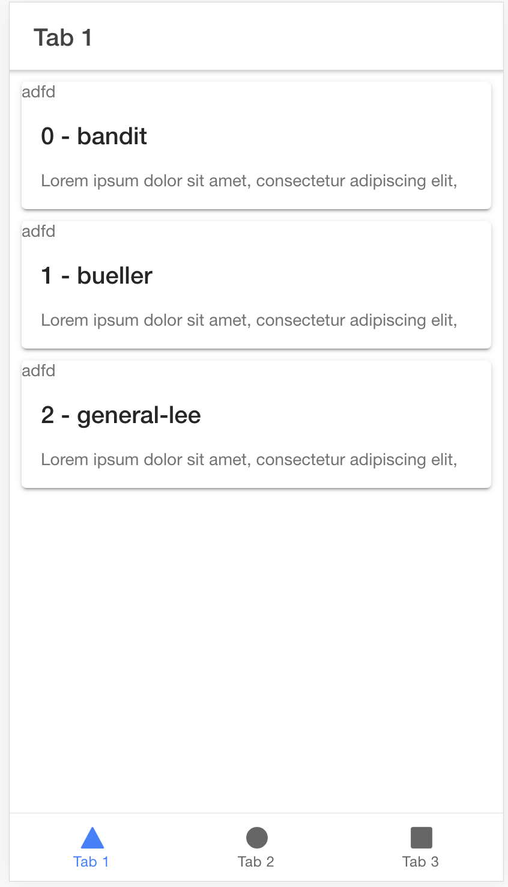

# Demo reproducing virtual scroll bug when nested within many elements in-between ion-content

Demo for Ionic PR: https://github.com/ionic-team/ionic-framework/pull/21581

## The problem
Virtual scroll, when nested within many elements in-between ion-content, will calculate hight to render wrongly and might thus not render items for the whole ion-content.

